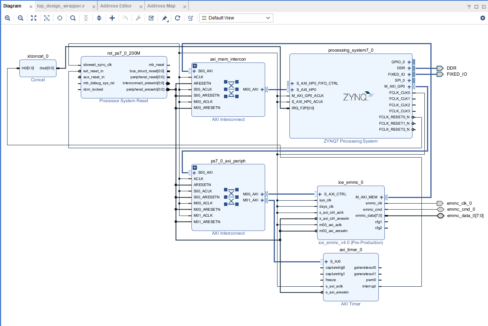

# ice_emmc_v4

1. 兼容 JEDEC eMMC Ver 5.1 标准接口
2. Xilinx 7系列 HS400@200Mhz
3. 一个 AXI-LITE 型接口供 CPU 进行控制
4. 一个 AXI4 型接口用于缓存数据接口
5. 暂时只支持 Xilinx 平台
6. 暂时未能支持有效的功耗控制

测试数据：

| 实时写入速度 |
|----:|
|249.09 MB/s|
|249.85 MB/s|
|249.14 MB/s|
|249.16 MB/s|
|249.78 MB/s|
|249.09 MB/s|
|247.24 MB/s|
|247.10 MB/s|
|249.10 MB/s|
|249.12 MB/s|
|249.73 MB/s|
|248.98 MB/s|
|249.14 MB/s|
|247.13 MB/s|

block design
